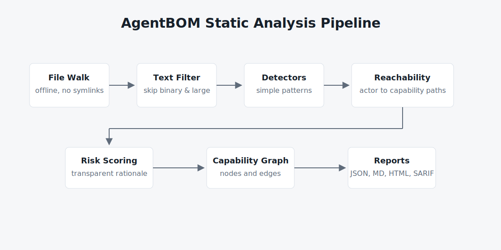
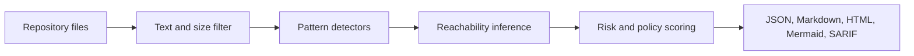

# AgentBOM


AgentBOM is an offline static scanner for AI-agent repositories. It maps
providers, model identifiers, frameworks, prompts, MCP servers, policy gaps, and
capabilities that appear reachable from an agent.

AgentBOM does not execute scanned code, import scanned modules, contact
networks, or store secret values. Findings are review signals, not exploit
verification.


## 30-second demo

```bash
pip install ai-agentbom
agentbom scan examples/simple_agent --output-dir agentbom-report --html --pretty
```

Open `agentbom-report/agentbom.html` and start with **Review Priorities** and
**Reachable Capabilities**. The JSON and Markdown reports are written next to
the HTML report for CI and pull request review.

## Quickstart

Install from PyPI:

```bash
pip install ai-agentbom
```

Scan a repository:

```bash
agentbom scan . --pretty
```

Generate review artifacts, including HTML, Mermaid, and SARIF:

```bash
agentbom scan . --output-dir agentbom-report --html --mermaid --sarif --pretty
```

Typical output:

```text
Wrote agentbom-report/agentbom.json
Wrote agentbom-report/agentbom.md
Wrote agentbom-report/agentbom.html
Wrote agentbom-report/agentbom.mmd
Wrote agentbom-report/agentbom.sarif
Risk: high (70/100)
```


## Screenshots

Current preview assets:

- [HTML report preview](docs/assets/html-report-preview.svg): repository risk,
  findings, and report navigation.
- [Terminal demo](docs/assets/terminal-demo.svg): install command, scan command,
  output files, and risk score.
- [Architecture flow](docs/assets/architecture-flow.svg): static analysis
  pipeline.

Recommended screenshot paths for launch images:

- `docs/images/terminal-quickstart.png`: install and scan output.
- `docs/images/html-report-summary.png`: top of `agentbom.html` with risk,
  providers, frameworks, and reachable capabilities visible.
- `docs/images/mcp-security-analysis.png`: MCP server table with risk
  categories and env variable names only.
- `docs/images/github-action-artifact-mode.png`: GitHub Action run with
  uploaded artifacts and passing CI.

See [`docs/images/README.md`](docs/images/README.md) for screenshot guidance.

## MCP Security Analysis

MCP servers can give an agent access to local files, command execution,
browsers, databases, cloud APIs, and env-backed services. AgentBOM parses MCP
JSON configuration as data. It records command, args, package, transport, env
variable names, and risk categories. It then reports MCP tool exposure when MCP
configuration appears near agent framework or prompt context.

Try the MCP demos:

```bash
agentbom scan examples/mcp-safe-agent \
  --output-dir agentbom-report/mcp-safe \
  --html --mermaid --sarif --pretty

agentbom scan examples/mcp-risky-agent \
  --output-dir agentbom-report/mcp-risky \
  --html --mermaid --sarif --pretty

agentbom scan examples/mcp-risky-agent \
  --policy examples/policies/mcp-policy.yaml \
  --output-dir agentbom-report/mcp-policy \
  --html --mermaid --sarif --pretty
```

AgentBOM does not execute MCP servers, contact networks, or store env values.
It records env variable names only, never secret values. Findings are review
signals, not exploit verification. See
[`docs/mcp-security-analysis.md`](docs/mcp-security-analysis.md).

## Why AgentBOM

AI agents combine model output with software capabilities. Package inventory and
general SAST tools do not usually show whether prompts, frameworks, model
identifiers, or MCP configuration are connected to those capabilities.

AgentBOM records that context:

- maps agent components: providers, statically detected model identifiers,
  frameworks, prompts, and MCP configuration
- analyzes MCP server definitions from JSON config, including command, args,
  transport, package or binary, env variable names, and risk categories
- connects agent actors to reachable capabilities such as shell, code execution,
  network, database, cloud, and MCP tool invocation
- records source paths, confidence, and rationale for review
- produces deterministic JSON plus human-readable Markdown and HTML
- exports Mermaid for architecture review and SARIF for GitHub code scanning
- runs offline with zero telemetry and no runtime dependencies

Findings are review signals. They require human review.

## Why this is different from SAST/SBOM

AgentBOM is not a replacement for SAST or SBOM tooling. SAST is best for
language-specific vulnerability patterns. SBOM tooling is best for package
inventory and license or vulnerability matching. AgentBOM answers a narrower
AI-agent question: which AI actors, prompts, frameworks, MCP servers, and
capabilities appear connected in this repository?

| Question | SAST/SBOM | AgentBOM |
| --- | --- | --- |
| What packages are present? | Yes | Yes, for AI-relevant manifests |
| Is there a risky API call? | SAST: yes | Coarse static signal only |
| Which AI provider or model identifier is present? | Usually no | Yes |
| Which agent framework may route tool calls? | Usually no | Yes |
| Are prompt or MCP surfaces present? | Usually no | Yes |
| Can an AI actor appear to reach a capability? | Usually no | Yes, by static inference |
| Does it work offline without executing code? | Depends on tool | Yes |
| Does output include source paths, confidence, and rationale? | Depends on tool | Yes |

Use SAST for language-specific vulnerability analysis. Use SBOM tools for
package inventory. Use AgentBOM to review AI-agent components and statically
inferred reachable capabilities.

## Demo Repositories

AgentBOM includes static demos under [`examples/`](examples/):

- [`examples/customer-support-agent`](examples/customer-support-agent): a
  controlled support agent with documented human approval and policy controls
- [`examples/mcp-safe-agent`](examples/mcp-safe-agent): a controlled MCP demo
  with local memory server metadata and human approval documentation
- [`examples/mcp-risky-agent`](examples/mcp-risky-agent): an MCP-focused demo
  with filesystem, shell/process, browser/network, database, cloud, and env
  backed server configuration
- [`examples/research-agent`](examples/research-agent): an intentionally riskier
  research agent with reachable shell/network behavior and missing policy
  documentation

Run the demos:

```bash
agentbom scan examples/customer-support-agent \
  --output-dir agentbom-report/support \
  --html --mermaid --sarif --pretty

agentbom scan examples/mcp-safe-agent \
  --output-dir agentbom-report/mcp-safe \
  --html --mermaid --sarif --pretty

agentbom scan examples/mcp-risky-agent \
  --output-dir agentbom-report/mcp-risky \
  --html --mermaid --sarif --pretty

agentbom scan examples/research-agent \
  --output-dir agentbom-report/research \
  --html --mermaid --sarif --pretty
```

See the [demo workflow](docs/demo-workflow.md) for a repeatable walkthrough.

## What It Finds

| Area | Examples |
| --- | --- |
| Providers | OpenAI, Anthropic, Gemini, Ollama, DeepSeek, OpenRouter |
| Models | Static model identifiers such as `gpt-5.1`, `gpt-4o-mini`, `o3-mini`, `claude-sonnet-4.6`, `gemini-3.1-pro`, `deepseek-r1`, `llama-3.3-70b-instruct`, `qwen2.5-coder`, `grok-4`, `command-r-plus`, `sonar-pro`, and provider-prefixed router strings |
| Frameworks | LangChain, LangGraph, LlamaIndex, CrewAI, AutoGen/AG2, Semantic Kernel, Pydantic AI, OpenAI Agents SDK, Claude Agent SDK, Mastra, Google ADK, Vercel AI SDK, LiteLLM, Instructor, Haystack, DSPy, LangServe |
| MCP | `mcp.json`, `.mcp.json`, `claude_desktop_config.json`, nested Cursor/Claude MCP config paths |
| MCP server risk | filesystem, shell/process, browser/network, database, cloud, secrets/env, unknown/custom servers |
| Prompts | `AGENTS.md`, `CLAUDE.md`, `prompts/*.md`, prompt YAML |
| Capabilities | shell, code execution, network, database, cloud, MCP tool invocation |
| Policy gaps | prompt files, MCP config, shell/cloud access without policy documentation |
| Secret references | credential names such as `OPENAI_API_KEY`, never values |

## Reports

AgentBOM always writes:

- `agentbom.json`: machine-readable findings
- `agentbom.md`: human-readable review report

Optional reports:

| Flag | Output | Use |
| --- | --- | --- |
| `--html` | `agentbom.html` | self-contained offline report for humans |
| `--mermaid` | `agentbom.mmd` | Mermaid graph |
| `--sarif` | `agentbom.sarif` | GitHub code scanning and SARIF consumers |
| `--cyclonedx` | `agentbom.cdx.json` | package ecosystem inventory workflows |

The report guide explains how to read the findings:
[`docs/report-guide.md`](docs/report-guide.md).

Diff-aware scans compare the current report with a baseline JSON report and
classify tracked findings as introduced, resolved, or unchanged:

```bash
agentbom scan . --baseline agentbom-baseline.json --fail-on-new high --sarif --html --pretty
```

`--fail-on-new` accepts `low`, `medium`, `high`, or `critical`. It evaluates new
providers, capabilities, MCP servers, secret references, and policy findings
introduced since the baseline.

## Architecture

AgentBOM uses a deterministic static-analysis pipeline:





Core concepts:

- Providers: AI service vendors or runtime providers.
- Models: concrete model identifiers found in code or configuration.
- Frameworks: agent and orchestration libraries.
- Capabilities: static evidence of sensitive actions.
- Reachable capabilities: static actor-to-capability relationships with risk
  and confidence.
- Policy findings: missing controls or custom policy violations.

See [ARCHITECTURE.md](ARCHITECTURE.md) for implementation details.

## GitHub Action

Use the action to run AgentBOM in pull requests and keep reports as workflow
artifacts. Start with informational mode when adding AgentBOM to an existing
repository. It publishes reports without failing CI or creating code scanning
alerts.

## Best first CI setup

Start in informational mode for at least one or two pull requests. Upload the
HTML, Markdown, and JSON reports as artifacts, but do not fail CI yet. Review
the baseline with the team, document expected capabilities, then enable
enforcement only for new high or critical findings.

```yaml
name: AgentBOM

on:
  pull_request:
  push:
    branches: [main]

permissions:
  contents: read

jobs:
  scan:
    runs-on: ubuntu-latest
    steps:
      - uses: actions/checkout@v4

      - name: Run AgentBOM
        uses: vlcak27/agentbom@v0.6.0
        with:
          path: .
          # Informational mode:
          # publish reports without blocking CI or creating code scanning alerts.
          fail-on: none
          sarif-upload: false
          html: true
          output-dir: agentbom-report

      - name: Upload AgentBOM reports
        uses: actions/upload-artifact@v4
        with:
          name: agentbom-report
          path: agentbom-report/
```

SARIF upload is optional. Enable it when you want findings in GitHub code
scanning:

```yaml
permissions:
  contents: read
  security-events: write

jobs:
  scan:
    runs-on: ubuntu-latest
    steps:
      - uses: actions/checkout@v4

      - name: Run AgentBOM
        uses: vlcak27/agentbom@v0.6.0
        with:
          path: .
          fail-on: none
          sarif-upload: true
          html: true
          output-dir: agentbom-report
```

Diff gating example for pull requests:

```yaml
      - name: Download AgentBOM baseline
        run: |
          git show origin/main:agentbom-report/agentbom.json > agentbom-baseline.json

      - name: Run diff-aware AgentBOM
        run: |
          agentbom scan . \
            --baseline agentbom-baseline.json \
            --fail-on-new high \
            --output-dir agentbom-report \
            --sarif \
            --html \
            --pretty
```

Operating modes:

- Informational mode: use `fail-on: none` with `sarif-upload: false`
  and `html: true`. JSON/Markdown/HTML reports are uploaded as artifacts, but
  the workflow does not fail on high or critical risk and does not create code
  scanning alerts.
- SARIF mode: set `sarif-upload: true` and grant `security-events: write` when
  you want findings visible in GitHub code scanning.
- Enforcement mode: keep report artifacts enabled, then set
  `fail-on: high` or `fail-on: critical` once the team has reviewed the baseline
  and documented expected capabilities.
- CI blocking mode: protect branches with the AgentBOM workflow required. In
  this mode, a configured `fail-on` threshold blocks merges when repository risk
  meets or exceeds the threshold while still publishing artifacts, and optionally
  SARIF, for review.

More details: [`docs/github-action.md`](docs/github-action.md).

## CLI Reference

```bash
agentbom --help
agentbom scan --help
```

Common commands:

```bash
agentbom scan /path/to/agent-repo --pretty
agentbom scan /path/to/agent-repo --output-dir agentbom-report --html
agentbom scan /path/to/agent-repo --output-dir agentbom-report --mermaid
agentbom scan /path/to/agent-repo --output-dir agentbom-report --sarif
agentbom scan /path/to/agent-repo --policy agentbom-policy.yaml --sarif --pretty
agentbom scan /path/to/agent-repo --baseline agentbom-baseline.json \
  --fail-on-new high --sarif --pretty
```

Example policy:

```yaml
deny_capabilities:
  - shell_execution
  - autonomous_execution

deny_mcp_risk_categories:
  - filesystem_access
  - shell_process_execution

require:
  sandboxing: true
  human_approval: true
```

## Output Example

Simplified JSON:

```json
{
  "schema_version": "0.1.0",
  "repository": "examples/research-agent",
  "providers": [
    {"name": "anthropic", "path": "agent.py", "confidence": "high"}
  ],
  "frameworks": [
    {"name": "crewai", "path": "agent.py", "confidence": "high"}
  ],
  "capabilities": [
    {"name": "shell", "path": "agent.py", "confidence": "high"}
  ],
  "reachable_capabilities": [
    {
      "capability": "code_execution",
      "reachable_from": "crewai",
      "source_file": "agent.py",
      "risk": "high",
      "confidence": "high",
      "confidence_score": 100,
      "paths": ["shell_execution"]
    }
  ],
  "repository_risk": {
    "score": 100,
    "severity": "critical",
    "rationale": [
      "high-risk reachable capability detected: autonomous_execution, code_execution",
      "autonomous execution is present or reachable",
      "shell or code execution is present or reachable"
    ]
  }
}
```

Secret values are not stored or printed. Secret findings record names such as
`OPENAI_API_KEY` so reviewers can see which credentials are referenced without
exposing the values.

## Known limitations

- Static analysis only; AgentBOM does not prove exploitability.
- Findings require human review and may include false positives.
- Reachability is inferred from nearby static evidence, not runtime traces.
- Detector coverage is intentionally AI-agent focused, not general SAST.
- Dependency parsing is basic and deterministic, not a full lockfile solver.
- Secret findings record variable names only, never values.
- No network calls during scanning.

## Security Model

AgentBOM is designed for safe repository review:

- does not execute scanned code
- does not import scanned modules
- does not evaluate project plugins or dynamic configuration
- skips files larger than 1 MB
- skips binary-looking files
- does not follow symlink loops
- records secret names only, never secret values
- works offline
- emits deterministic output for the same input repository

Static analysis is intentionally conservative. Results should be reviewed by a
human before being treated as a security decision.

## Development

Contributor and security docs:

- [CONTRIBUTING.md](CONTRIBUTING.md)
- [SECURITY.md](SECURITY.md)
- [CHANGELOG.md](CHANGELOG.md)

Install in editable mode:

```bash
pip install -e ".[dev]"
```

Run tests and linting:

```bash
ruff check .
pytest
```

Or use:

```bash
make check
make demo
```

Scan the demo repository:

```bash
agentbom scan examples/research-agent --output-dir agentbom-report --html --mermaid --sarif --pretty
```

## Repository Structure

```text
.
|-- src/agentbom/              # CLI, scanner, detectors, reports, exports
|-- tests/                     # pytest coverage for scanner and outputs
|-- docs/                      # report guide, demo workflow, schemas, assets
|-- examples/                  # demo repositories for scans
|-- .github/                   # workflows, issue templates, release templates
|-- action.yml                 # reusable GitHub Action definition
|-- ARCHITECTURE.md            # scanner design notes
|-- ROADMAP.md                 # planned improvements
|-- SPEC.md                    # project specification
`-- pyproject.toml             # package metadata and dev tooling
```

## Roadmap

Near-term improvements focus on better package/config parsing, more detector
coverage, deeper MCP analysis, and clearer policy validation while preserving
offline operation, deterministic output, zero telemetry, and minimal
dependencies.

See [ROADMAP.md](ROADMAP.md).
