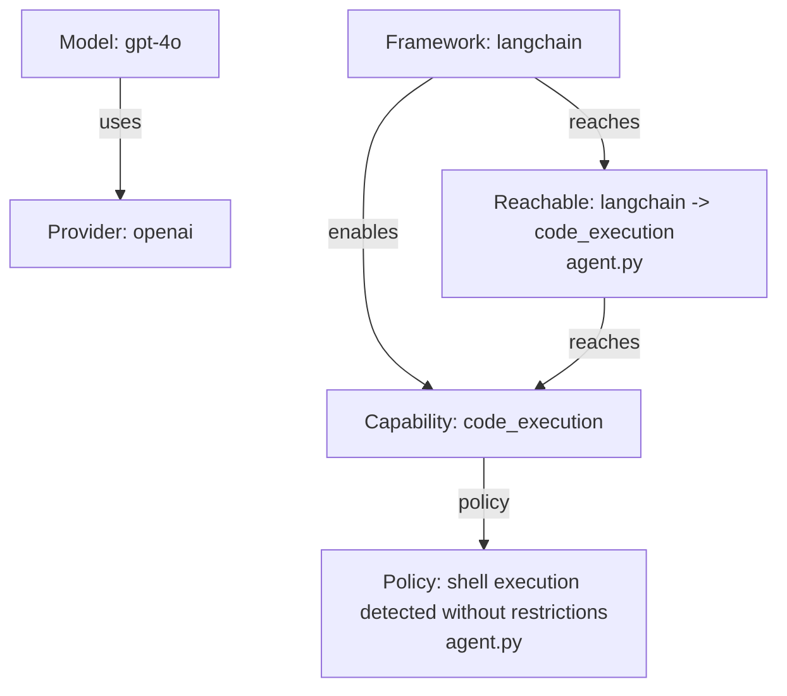

# AgentBOM


Explainable AI agent bill of materials and attack surface scanner.

AgentBOM is a small CLI for reviewing AI agent repositories. It scans source and
configuration files, detects AI providers, models, frameworks, prompts, MCP
configuration, risky capabilities, reachable capabilities, policy gaps, and
secret references by name. It can also export a Mermaid graph that shows how
models, frameworks, capabilities, and policy findings relate.

It does not execute scanned code, import scanned modules, read secret values, or
require network access.

## Why AgentBOM?

AI agents combine model output with software capabilities. A normal dependency
inventory does not show whether a model or framework can reach shell execution,
network clients, cloud SDKs, MCP servers, prompt files, or missing policy
controls.

AgentBOM makes that review repeatable:

- identify the AI-specific components in a repository
- connect models, frameworks, and tool configuration to reachable capabilities
- report source paths and confidence values for every finding
- visualize attack surface relationships as a GitHub-native Mermaid graph
- generate machine-readable output for CI and human-readable reports for review
- run offline in local development, private repositories, and restricted CI

Findings are review signals, not exploit claims.

## Features

- Offline static scanning
- Provider detection for OpenAI, Anthropic, and Gemini
- Model identifier detection in source and configuration
- Agent framework detection for LangChain, LlamaIndex, CrewAI, AutoGen, and
  Semantic Kernel
- MCP configuration detection for `mcp.json` and `claude_desktop_config.json`
- Prompt surface detection for `AGENTS.md`, `CLAUDE.md`, prompt YAML, and
  `prompts/*.md`
- Risky capability detection for shell, code execution, network, database,
  cloud, and autonomous behavior
- Reachability inference from models, frameworks, and MCP configuration to
  capabilities
- Policy findings for missing or weak controls
- Secret reference detection by name only
- Mermaid capability graph export
- JSON, Markdown, HTML, Mermaid, SARIF, and CycloneDX output

## Quickstart

Install from PyPI:

```bash
pip install ai-agentbom
```

Scan the current repository:

```bash
agentbom scan .
```

Generate an offline HTML report:

```bash
agentbom scan . --html
```

Generate SARIF for code scanning:

```bash
agentbom scan . --sarif
```

Generate a Mermaid capability graph:

```bash
agentbom scan . --mermaid
```

Write all reports to a dedicated directory:

```bash
agentbom scan . --output-dir agentbom-report --pretty --html --mermaid --sarif
```

Typical output:

```text
Wrote agentbom-report/agentbom.json
Wrote agentbom-report/agentbom.md
Wrote agentbom-report/agentbom.html
Wrote agentbom-report/agentbom.mmd
Wrote agentbom-report/agentbom.sarif
```

## Usage

Basic scan:

```bash
agentbom scan /path/to/agent-repo
```

Pretty JSON:

```bash
agentbom scan /path/to/agent-repo --pretty
```

HTML security report:

```bash
agentbom scan /path/to/agent-repo --output-dir agentbom-report --html
```

Mermaid capability graph:

```bash
agentbom scan /path/to/agent-repo --output-dir agentbom-report --mermaid
```

SARIF report:

```bash
agentbom scan /path/to/agent-repo --output-dir agentbom-report --sarif
```

CycloneDX report:

```bash
agentbom scan /path/to/agent-repo --output-dir agentbom-report --cyclonedx
```

Custom policy:

```bash
agentbom scan /path/to/agent-repo --policy agentbom-policy.yaml --sarif --pretty
```

Example policy:

```yaml
deny_capabilities:
  - shell_execution
  - autonomous_execution

require:
  sandboxing: true
  human_approval: true
```

## Reports

AgentBOM always writes:

- `agentbom.json`: machine-readable findings
- `agentbom.md`: human-readable Markdown report

Optional reports:

- `agentbom.html`: self-contained offline HTML security report
- `agentbom.mmd`: Mermaid flowchart for visual attack surface review
- `agentbom.sarif`: SARIF 2.1.0 for GitHub code scanning and other tools
- `agentbom.cdx.json`: CycloneDX JSON export

### HTML Reports

Use `--html` when you want a local review artifact that can be opened without a
server or external assets.

```bash
agentbom scan . --output-dir agentbom-report --html --pretty
open agentbom-report/agentbom.html
```

The HTML report includes repository risk, detected providers and models,
frameworks, capabilities, reachable capabilities, policy findings, prompt
surfaces, secret references by name, and the capability graph.

### Mermaid Graphs

Use `--mermaid` when you want a GitHub-native visual explanation of the scanned
AI attack surface.

```bash
agentbom scan . --output-dir agentbom-report --mermaid --pretty
```

The generated `agentbom.mmd` is deterministic Mermaid flowchart syntax. It
contains nodes for providers, models, frameworks, capabilities, reachable
capabilities, and policy findings. Edges show `uses`, `enables`, `reaches`, and
`policy` relationships. Nodes are styled by severity: `low`, `medium`, `high`,
and `critical`.

Example:



### SARIF and GitHub Code Scanning

Generate SARIF locally:

```bash
agentbom scan . --output-dir agentbom-report --sarif --pretty
```

Upload SARIF in GitHub Actions:

```yaml
name: AgentBOM Security Scan

on:
  push:
    branches: [main]
  pull_request:

permissions:
  contents: read
  security-events: write

jobs:
  agentbom:
    runs-on: ubuntu-latest
    steps:
      - uses: actions/checkout@v4

      - name: Install AgentBOM
        run: pip install ai-agentbom

      - name: Run AgentBOM
        run: agentbom scan . --output-dir agentbom-report --sarif --pretty

      - name: Upload SARIF
        uses: github/codeql-action/upload-sarif@v3
        with:
          sarif_file: agentbom-report/agentbom.sarif
```

You can also use the bundled action:

```yaml
- name: Run AgentBOM
  uses: vlcak27/agentbom@v1
  with:
    path: .
    fail-on: critical
    sarif-upload: true
```

## Output Example

Simplified JSON output:

```json
{
  "schema_version": "0.1.0",
  "repository": "examples/simple_agent",
  "providers": [
    {"name": "openai", "path": "agent.py", "confidence": "high"}
  ],
  "frameworks": [
    {"name": "langchain", "path": "agent.py", "confidence": "high"}
  ],
  "capabilities": [
    {"name": "shell", "path": "agent.py", "confidence": "high"}
  ],
  "reachable_capabilities": [
    {
      "capability": "code_execution",
      "reachable_from": "langchain",
      "source_file": "agent.py",
      "risk": "high",
      "confidence": "high",
      "confidence_score": 100,
      "paths": ["shell_execution"]
    }
  ],
  "repository_risk": {
    "score": 90,
    "severity": "critical",
    "rationale": [
      "high-risk reachable capability detected: code_execution",
      "shell or code execution is present or reachable"
    ]
  }
}
```

Example SARIF result:

```json
{
  "ruleId": "reachable.code_execution",
  "level": "error",
  "message": {
    "text": "langchain reaches code_execution with high risk"
  },
  "locations": [
    {
      "physicalLocation": {
        "artifactLocation": {
          "uri": "agent.py"
        }
      }
    }
  ]
}
```

Secret values are not stored or printed. Secret findings record names such as
`OPENAI_API_KEY` so reviewers can see which credentials are referenced without
exposing the values.

## Screenshots and Examples

AgentBOM outputs are intentionally plain files that work well in code review:

- `agentbom.html` for a self-contained local security report
- `agentbom.mmd` for visual capability and policy relationships
- `agentbom.sarif` for GitHub code scanning annotations
- `agentbom.json` for custom checks and automation

Mermaid is useful for explaining why a finding matters: it shows the path from an
AI actor to a reachable capability and the related policy finding without using
external services.

## Use Cases

### AI Agent Auditing

Review agent repositories before deployment. Identify model providers,
frameworks, prompt surfaces, policy gaps, and reachable execution paths.

### MCP Security Review

Detect MCP configuration and connect tool configuration to local capabilities so
reviewers can inspect what an agent may be able to reach.

### CI Security Scanning

Run AgentBOM in pull requests and upload SARIF to GitHub code scanning. Use the
JSON report as a stable artifact for policy checks or dashboards.

### AI Governance

Create repeatable evidence for AI system reviews: providers, models,
capabilities, policy controls, and risk rationale in a deterministic report.

## Architecture

AgentBOM uses a deterministic static-analysis pipeline:

1. Walk the target directory without following symlinks.
2. Skip dependency, build, cache, VCS, binary-looking, and oversized files.
3. Run simple text detectors over source and configuration files.
4. Infer reachable capabilities from source-file locality and detected actors.
5. Build a capability graph.
6. Score scanner-level risks, policy findings, and repository risk.
7. Write JSON, Markdown, and optional HTML, Mermaid, SARIF, or CycloneDX reports.

Core concepts:

- Providers: AI service vendors or runtime providers.
- Models: concrete model identifiers found in code or configuration.
- Frameworks: agent and orchestration libraries.
- Capabilities: static evidence of sensitive actions.
- Reachable capabilities: actor-to-capability relationships with risk and
  confidence.
- Policy findings: missing controls or custom policy violations.

See [ARCHITECTURE.md](ARCHITECTURE.md) for more detail.

## Repository Structure

```text
.
|-- src/agentbom/              # CLI, scanner, detectors, reports, exports
|-- tests/                     # pytest coverage for scanner and outputs
|-- docs/output-schema.json    # JSON report schema
|-- examples/simple_agent/     # small example repository for scans
|-- .github/workflows/         # CI, release, and AgentBOM action examples
|-- action.yml                 # reusable GitHub Action definition
|-- ARCHITECTURE.md            # scanner design notes
|-- ROADMAP.md                 # planned improvements
|-- SPEC.md                    # project specification
`-- pyproject.toml             # package metadata and dev tooling
```

## Security Model

AgentBOM is designed for safe repository review:

- does not execute scanned code
- does not import scanned modules
- does not evaluate project plugins or dynamic configuration
- skips files larger than 1 MB
- skips binary-looking files
- does not follow symlink loops
- records secret names only, never secret values
- works offline

Static analysis is intentionally conservative. Results should be reviewed by a
human before being treated as a security decision.

## Development

Install in editable mode:

```bash
pip install -e ".[dev]"
```

Run tests and linting:

```bash
ruff check .
python -m pytest
```

Scan the example repository:

```bash
agentbom scan examples/simple_agent --pretty --html --mermaid --sarif
```

## Roadmap

- Better package and configuration parsing
- More model and framework detectors
- Deeper MCP transport and command analysis
- Tool permission classification
- Policy allowlists and denylists
- Baseline comparison
- Expanded SARIF coverage
- SPDX export is not implemented yet
