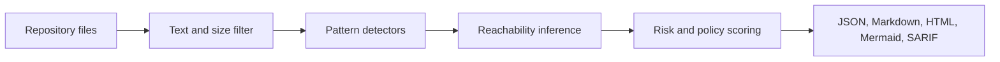

# AgentBOM


Offline bill of materials and attack surface analysis for AI agent repositories.

AgentBOM helps reviewers answer a practical question: what AI providers, model
identifiers, frameworks, prompts, MCP configuration, and sensitive capabilities
exist in this agent repository, and which of those capabilities appear reachable
from an AI actor?

It does not execute scanned code, import scanned modules, read secret values, or
require network access.


## Quickstart

Install from PyPI:

```bash
pip install ai-agentbom
```

Scan a repository:

```bash
agentbom scan . --pretty
```

Generate shareable review artifacts, including HTML for humans, Mermaid for
architecture review, and SARIF for GitHub code scanning:

```bash
agentbom scan . --output-dir agentbom-report --html --mermaid --sarif --pretty
```

Typical output:

```text
Wrote agentbom-report/agentbom.json
Wrote agentbom-report/agentbom.md
Wrote agentbom-report/agentbom.html
Wrote agentbom-report/agentbom.mmd
Wrote agentbom-report/agentbom.sarif
Risk: high (70/100)
```


## Why AgentBOM

AI agents combine model output with software capabilities. A dependency list,
generic SBOM, or general static analyzer can tell you that code imports a
package or calls a risky API, but it usually does not explain whether an agent
framework, model identifier, prompt, or MCP configuration appears connected to
that capability.

AgentBOM makes that review repeatable:

- maps AI-specific components: providers, statically detected model identifiers,
  frameworks, prompts, and MCP configuration
- connects agent actors to reachable capabilities such as shell, code execution,
  network, database, cloud, and MCP tool invocation
- records source paths, confidence, and rationale for review
- produces deterministic JSON plus human-readable Markdown and HTML
- exports Mermaid for attack-surface review and SARIF for GitHub code scanning
- runs offline with zero telemetry and no runtime dependencies

Findings are review signals, not exploit claims.

## AgentBOM vs. Traditional SAST

AgentBOM is not a replacement for SAST. It is a focused companion for AI agent
review.

| Question | Traditional SAST | AgentBOM |
| --- | --- | --- |
| Is there a risky API call? | Yes | Yes, at a coarse deterministic level |
| Which AI provider or model identifier is present? | Usually no | Yes, by static detection |
| Which agent framework may route tool calls? | Usually no | Yes |
| Are prompt or MCP surfaces present? | Usually no | Yes |
| Can an AI actor appear to reach a capability? | Usually no | Yes |
| Does it work offline without executing code? | Depends on tool | Yes |
| Is output designed for AI governance evidence? | Usually no | Yes |

Use SAST for language-specific vulnerability analysis and generic SBOM tools for
package inventory. Use AgentBOM to explain the AI-specific bill of materials,
including which agent actors appear connected to sensitive capabilities.

## Demo Repositories

AgentBOM includes realistic static demos under [`examples/`](examples/):

- [`examples/customer-support-agent`](examples/customer-support-agent): a
  controlled support agent with documented human approval and policy controls
- [`examples/research-agent`](examples/research-agent): an intentionally riskier
  research agent with reachable shell/network behavior and missing policy
  documentation

Run both demos:

```bash
agentbom scan examples/customer-support-agent --output-dir agentbom-report/support --html --mermaid --sarif --pretty
agentbom scan examples/research-agent --output-dir agentbom-report/research --html --mermaid --sarif --pretty
```

See the [demo workflow](docs/demo-workflow.md) for a repeatable walkthrough.

## What It Finds

| Area | Examples |
| --- | --- |
| Providers | OpenAI, Anthropic, Gemini, Ollama, DeepSeek, OpenRouter |
| Models | Static model identifiers such as `gpt-5.5`, `gpt-5.4-mini`, `gpt-4o-mini`, `o3`, `claude-opus-4.7`, `gemini-2.5-pro`, `deepseek-reasoner`, `llama3.3`, `qwen3`, `openrouter/openai/gpt-5.5` |
| Frameworks | LangChain, LangGraph, LlamaIndex, CrewAI, AutoGen, Semantic Kernel |
| MCP | `mcp.json`, `claude_desktop_config.json` |
| Prompts | `AGENTS.md`, `CLAUDE.md`, `prompts/*.md`, prompt YAML |
| Capabilities | shell, code execution, network, database, cloud, MCP tool invocation |
| Policy gaps | prompt files, MCP config, shell/cloud access without policy documentation |
| Secret references | credential names such as `OPENAI_API_KEY`, never values |

## Reports

AgentBOM always writes:

- `agentbom.json`: machine-readable findings
- `agentbom.md`: human-readable review report

Optional reports:

| Flag | Output | Use |
| --- | --- | --- |
| `--html` | `agentbom.html` | self-contained offline report for humans |
| `--mermaid` | `agentbom.mmd` | GitHub-native attack surface graph |
| `--sarif` | `agentbom.sarif` | GitHub code scanning and SARIF consumers |
| `--cyclonedx` | `agentbom.cdx.json` | package ecosystem inventory workflows |

The report guide explains how to read the findings:
[`docs/report-guide.md`](docs/report-guide.md).

Diff-aware scans compare the current report with a baseline JSON report and
classify tracked findings as introduced, resolved, or unchanged:

```bash
agentbom scan . --baseline agentbom-baseline.json --fail-on-new high --sarif --html --pretty
```

`--fail-on-new` accepts `low`, `medium`, `high`, or `critical`. It only evaluates
new providers, capabilities, secret references, and policy findings introduced
since the baseline.

## Architecture

AgentBOM uses a deterministic static-analysis pipeline:




Core concepts:

- Providers: AI service vendors or runtime providers.
- Models: concrete model identifiers found in code or configuration.
- Frameworks: agent and orchestration libraries.
- Capabilities: static evidence of sensitive actions.
- Reachable capabilities: actor-to-capability relationships with risk and
  confidence.
- Policy findings: missing controls or custom policy violations.

See [ARCHITECTURE.md](ARCHITECTURE.md) for implementation details.

## GitHub Action

Use the bundled action to run AgentBOM in pull requests, upload SARIF, and keep
the HTML/JSON/Markdown reports as workflow artifacts.

```yaml
name: AgentBOM

on:
  pull_request:
  push:
    branches: [main]

permissions:
  contents: read
  security-events: write

jobs:
  scan:
    runs-on: ubuntu-latest
    steps:
      - uses: actions/checkout@v4

      - name: Run AgentBOM
        uses: vlcak27/agentbom@v0.5.2
        with:
          path: .
          # Informational mode for demos and first-time rollout:
          # publish SARIF and reports without blocking CI on findings.
          fail-on: none
          sarif-upload: true
          html: true
          output-dir: agentbom-report
          # Enforcement examples for teams ready to gate merges:
          # fail-on: high
          # fail-on: critical

      - name: Upload AgentBOM reports
        uses: actions/upload-artifact@v4
        with:
          name: agentbom-report
          path: agentbom-report/
```

Diff gating example for pull requests:

```yaml
      - name: Download AgentBOM baseline
        run: |
          git show origin/main:agentbom-report/agentbom.json > agentbom-baseline.json

      - name: Run diff-aware AgentBOM
        run: |
          agentbom scan . \
            --baseline agentbom-baseline.json \
            --fail-on-new high \
            --output-dir agentbom-report \
            --sarif \
            --html \
            --pretty
```

Operating modes:

- Informational mode: use `fail-on: none` with `sarif-upload: true` and
  `html: true`. Findings remain visible in GitHub code scanning through SARIF,
  and JSON/Markdown/HTML reports are uploaded as artifacts, but the workflow does
  not fail on high or critical risk.
- Enforcement mode: keep SARIF and report artifacts enabled, then set
  `fail-on: high` or `fail-on: critical` once the team has reviewed the baseline
  and documented expected capabilities. This turns AgentBOM from visibility into
  an explicit security policy.
- CI blocking mode: protect branches with the AgentBOM workflow required. In
  this mode, a configured `fail-on` threshold blocks merges when repository risk
  meets or exceeds the threshold while still publishing SARIF and artifacts for
  review.

More details: [`docs/github-action.md`](docs/github-action.md).

## CLI Reference

```bash
agentbom --help
agentbom scan --help
```

Common commands:

```bash
agentbom scan /path/to/agent-repo --pretty
agentbom scan /path/to/agent-repo --output-dir agentbom-report --html
agentbom scan /path/to/agent-repo --output-dir agentbom-report --mermaid
agentbom scan /path/to/agent-repo --output-dir agentbom-report --sarif
agentbom scan /path/to/agent-repo --policy agentbom-policy.yaml --sarif --pretty
agentbom scan /path/to/agent-repo --baseline agentbom-baseline.json --fail-on-new high --sarif --pretty
```

Example policy:

```yaml
deny_capabilities:
  - shell_execution
  - autonomous_execution

require:
  sandboxing: true
  human_approval: true
```

## Output Example

Simplified JSON:

```json
{
  "schema_version": "0.1.0",
  "repository": "examples/research-agent",
  "providers": [
    {"name": "anthropic", "path": "agent.py", "confidence": "high"}
  ],
  "frameworks": [
    {"name": "crewai", "path": "agent.py", "confidence": "high"}
  ],
  "capabilities": [
    {"name": "shell", "path": "agent.py", "confidence": "high"}
  ],
  "reachable_capabilities": [
    {
      "capability": "code_execution",
      "reachable_from": "crewai",
      "source_file": "agent.py",
      "risk": "high",
      "confidence": "high",
      "confidence_score": 100,
      "paths": ["shell_execution"]
    }
  ],
  "repository_risk": {
    "score": 100,
    "severity": "critical",
    "rationale": [
      "high-risk reachable capability detected: autonomous_execution, code_execution",
      "autonomous execution is present or reachable",
      "shell or code execution is present or reachable"
    ]
  }
}
```

Secret values are not stored or printed. Secret findings record names such as
`OPENAI_API_KEY` so reviewers can see which credentials are referenced without
exposing the values.

## Security Model

AgentBOM is designed for safe repository review:

- does not execute scanned code
- does not import scanned modules
- does not evaluate project plugins or dynamic configuration
- skips files larger than 1 MB
- skips binary-looking files
- does not follow symlink loops
- records secret names only, never secret values
- works offline
- emits deterministic output for the same input repository

Static analysis is intentionally conservative. Results should be reviewed by a
human before being treated as a security decision.

## Development

Contributor and security docs:

- [CONTRIBUTING.md](CONTRIBUTING.md)
- [SECURITY.md](SECURITY.md)
- [CHANGELOG.md](CHANGELOG.md)

Install in editable mode:

```bash
pip install -e ".[dev]"
```

Run tests and linting:

```bash
ruff check .
pytest
```

Or use:

```bash
make check
make demo
```

Scan the demo repository:

```bash
agentbom scan examples/research-agent --output-dir agentbom-report --html --mermaid --sarif --pretty
```

## Repository Structure

```text
.
|-- src/agentbom/              # CLI, scanner, detectors, reports, exports
|-- tests/                     # pytest coverage for scanner and outputs
|-- docs/                      # report guide, demo workflow, schemas, assets
|-- examples/                  # demo repositories for scans
|-- .github/                   # workflows, issue templates, release templates
|-- action.yml                 # reusable GitHub Action definition
|-- ARCHITECTURE.md            # scanner design notes
|-- ROADMAP.md                 # planned improvements
|-- SPEC.md                    # project specification
`-- pyproject.toml             # package metadata and dev tooling
```

## Roadmap

Near-term improvements focus on better package/config parsing, more detector
coverage, deeper MCP analysis, and clearer policy validation while preserving
offline operation, deterministic output, zero telemetry, and minimal
dependencies.

See [ROADMAP.md](ROADMAP.md).
