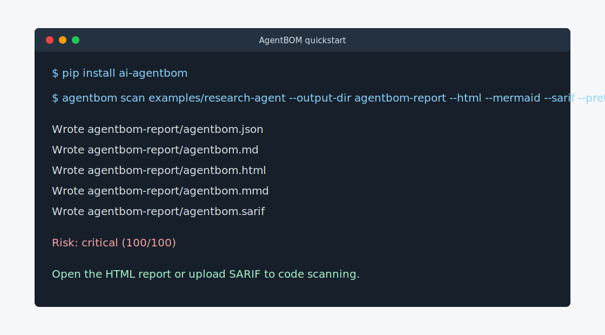
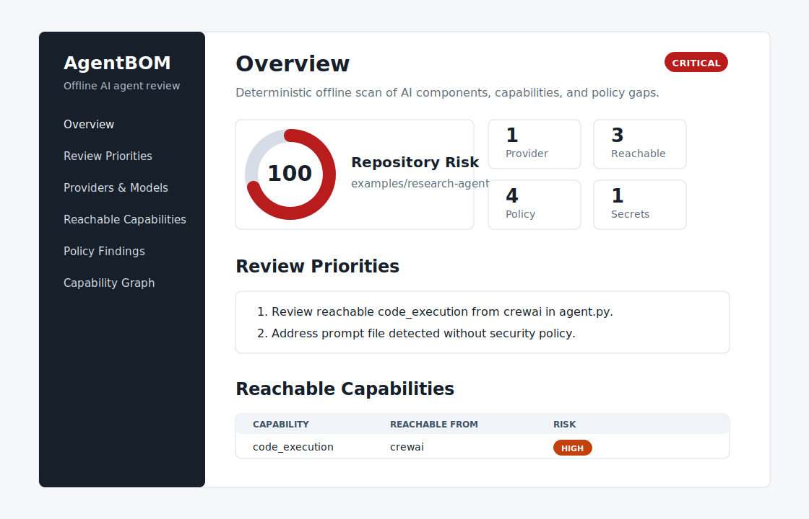

# Demo Workflow

Use this workflow when recording a demo, writing a release post, or validating
the first-run experience.

## 1. Install

```bash
pip install ai-agentbom
```

## 2. Scan a controlled agent

```bash
agentbom scan examples/customer-support-agent \
  --output-dir agentbom-report/support \
  --html \
  --mermaid \
  --sarif \
  --pretty
```

Expected use: show that AgentBOM identifies AI components and capabilities while
recognizing documented controls.

## 3. Scan a riskier agent

```bash
agentbom scan examples/research-agent \
  --output-dir agentbom-report/research \
  --html \
  --mermaid \
  --sarif \
  --pretty
```

Expected use: show review priorities, reachable capabilities, policy findings,
and SARIF output.

## 4. Open the reports

```bash
open agentbom-report/research/agentbom.html
cat agentbom-report/research/agentbom.mmd
```

The HTML report is self-contained and works offline. The Mermaid report can be
pasted into GitHub Markdown or rendered by tools that support Mermaid.




